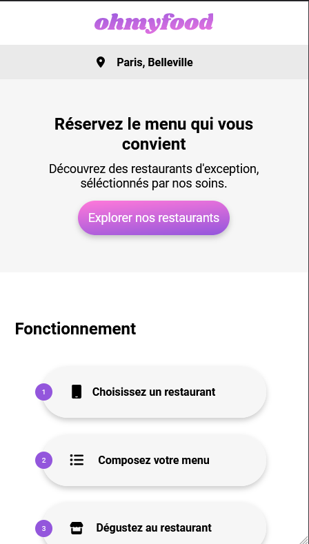

# Projet 3 : Ohmyfood
   

## Description
Cette application permet aux utilisateurs de composer leur propre menu et réduire leur temps d’attente dans les restaurants car leur menu est préparé à l’avance.

L'application contient un loader suivi d'un index contenant la liste des restaurants disponibles pour passer commande. Une fonction ajouter ce restaurant aux favoris a été prévu. 

L'utilisateur doit cliquer sur le restaurant de son choix qui lui permettera d'accéder à la liste des plats proposés par ce dernier. Il pourra ainsi sélectionner les plats de son choix et les ajouter à son panier.
***
## Technologies utilisées
 

***
## Compatibilité
Mobile Tablettes Desktop.
***
## Requirements
La version actuelle ne nécessite aucuns parametrage afin de pouvoir être consultée.
***
## Voir la dernière version en ligne
[http://mygithubpage.com/](http://mygithubpage.com/)
***
## Prévisualisation

***
## Organisation interne du projet

**Chef de projet : Paul**

**UX Designer : Fanny**

**Intégrateur : Julien**

