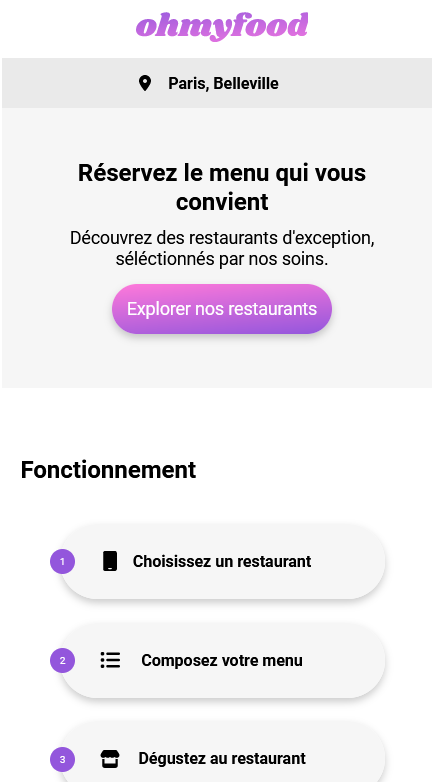

# Projet 3 : Ohmyfood
   

## 🍔 Description
This app allows users to create and compose their own menu in advance and reduce their waiting time at the restaurant.

This app contains a loader follow by an index, the user will find a list of restaurants available to order. A widget "like" has been added on the restaurants's cards.

The user must click on the restaurant's card of his choice to get the acces of the list of the courses availables, then he will be able to select whatever he wants to order.

## 🚀 Technologies used
 

## 👩‍💻 Compatibility
Mobiles Tablettes Desktops.

## 📱 Requirements
The actual version doesn't requires any settings to work. You'll find a link to preview the app.

## 🌐 Last online version
[http://mygithubpage.com/](http://mygithubpage.com/)

## 💻 Preview

## 👨 Internal organisation of this project

**Projet manager : Paul**

**UX Designer : Fanny**

**Integrator : Julien**

